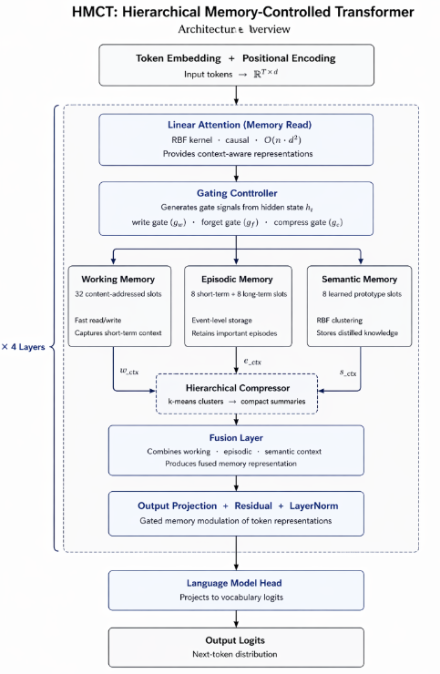

# HMCT: Hierarchical Memory-Controlled Transformer | [[Paper]](HMCT.pdf)

A hierarchical memory-augmented Transformer architecture for efficient long-context sequence modeling using gated working, episodic, and semantic memory with linear attention.


---

## Overview

Transformers have become the foundation of modern sequence modeling, yet they face two fundamental limitations: the quadratic computational complexity of self-attention and the absence of explicit mechanisms for retaining and managing long-term information. While attention enables rich token interactions, it treats all contextual information uniformly without distinguishing between short-term, episodic, and semantic memory.

The **Hierarchical Memory-Controlled Transformer (HMCT)** addresses these limitations by extending a causal Transformer with a cognitive-inspired hierarchical memory system comprising dedicated **Working**, **Episodic**, and **Semantic** memory modules. These memory tiers are governed by learnable write, forget, and compression gates that selectively retain, discard, and consolidate information throughout training and inference.

To improve scalability, HMCT integrates a linear-attention recurrence within the memory pathway, enabling efficient long-context reasoning while maintaining interpretable memory dynamics.

This repository contains the complete implementation, experimental evaluation, and analysis presented in the accompanying research paper.

---

## Key Features

- Hierarchical multi-tier memory architecture
- Working, Episodic, and Semantic memory modules
- Learnable write, forget, and compression gates
- Linear attention recurrence for efficient long-context modeling
- Near-linear inference scaling
- Interpretable memory utilization analysis
- Long-context generalization beyond training sequence lengths
- PyTorch implementation contained within a single Jupyter Notebook

---

## Architecture

```
                                      Input Sequence
                                            │
                                   Token Embeddings
                                            │
                                  Positional Encoding
                                            │
                           ┌─────────────────────────────┐
                           │  Causal Transformer Block   │
                           │  (Self-Attention + FFN)     │
                           └──────────────┬──────────────┘
                                          │
                     ┌────────────────────┼────────────────────┐
                     │                    │                    │
                     ▼                    ▼                    ▼
            Working Memory         Episodic Memory     Semantic Memory
               (16 Slots)             (8 Slots)           (4 Slots)
            Write Gate (gw)        Forget Gate (gf)   Compress Gate (gc)
                     │                    │                    │
                     └──────────────┬─────┴────────────┬───────┘
                                    │
                          Memory Fusion Layer
                                    │
                        Linear Attention Recurrence
                                    │
                           Residual Connection
                                    │
                           Output Projection Layer
                                    │
                               Token Prediction
```

### Model Architecture

<p align="center">
    
</p>

*Figure 1. HMCT architecture illustrating the integration of hierarchical working, episodic, and semantic memory modules with a causal Transformer backbone.*

---

## Methodology

HMCT augments a standard causal Transformer by introducing three complementary memory systems inspired by cognitive memory models:

### Working Memory

A short-term memory module responsible for actively retaining recent contextual information. Memory updates are regulated through a learnable **write gate**, allowing selective storage of relevant representations.

### Episodic Memory

Designed to preserve event-level contextual representations across longer horizons. A learnable **forget gate** determines which information should persist or be discarded during training.

### Semantic Memory

Stores compressed high-level knowledge using clustering-based abstraction. A learnable **compression gate** governs consolidation into semantic memory for efficient long-term representation.

### Linear Attention

Instead of relying solely on quadratic self-attention, HMCT incorporates a linear-attention recurrence within the memory pathway, significantly improving computational efficiency for long sequences.

---

## Experimental Results

HMCT was evaluated on the **Selective Copy-Paste with Distraction (SCPD)** benchmark under controlled experimental settings.

| Metric | HMCT |
|---------|------|
| Validation Accuracy | **100%** |
| Long-Context Generalization | Excellent |
| Inference Scaling | Near Linear |
| Memory Architecture | Working + Episodic + Semantic |
| Attention Mechanism | Linear Attention |

### Highlights

- Achieved **100% validation accuracy** after training convergence.
- Demonstrated excellent long-context generalization without retraining.
- Maintained near-linear inference scaling with increasing sequence length.
- Learned interpretable memory management policies through gated memory modules.
- Exhibited stable working memory utilization and meaningful gate dynamics throughout training.

---

## Repository Contents

```
HMCT.ipynb      Complete implementation including:

• Dataset generation
• HMCT architecture
• Baseline Transformer
• Training pipeline
• Validation
• Ablation studies
• Memory gate analysis
• Working memory utilization
• Long-context generalization experiments
• Scaling benchmarks
• Performance visualizations

HMCT.pdf        Research paper describing the proposed architecture
README.md       Project documentation
```

---

## Technology Stack

- Python 3.10+
- PyTorch
- CUDA
- Jupyter Notebook

---

## Research Contributions

This work proposes:

- A novel hierarchical memory architecture for Transformer models
- Explicit Working, Episodic, and Semantic memory modules
- Learnable write, forget, and compression mechanisms
- Linear-attention based memory retrieval
- Memory utilization diagnostics through gate analysis
- Near-linear inference scaling for long-context sequence modeling

---

## Future Work

Potential directions for future research include:

- Multi-layer HMCT architectures
- Evaluation on real-world NLP benchmarks
- Passkey Retrieval and Document Question Answering
- Long-document understanding
- Multi-modal hierarchical memory
- Optimized CUDA kernels for memory operations
- Scaling to larger language models

---

## Authors

**Likith S G**  
Nithin S  
Mohith R  
Nithin S

Department of Computer Science and Engineering  
RV University, Bengaluru, India

---

## Citation

If you use this work in your research, please cite:

```bibtex
@article{hmct2026,
  title={A Unified Hierarchical Memory-Controlled Transformer Architecture for Long-Context Modeling},
  author={Likith S G and Nithin S and Mohith R and Nithin S},
  year={2026}
}
```

---

## License

This project is released for academic and research purposes.
